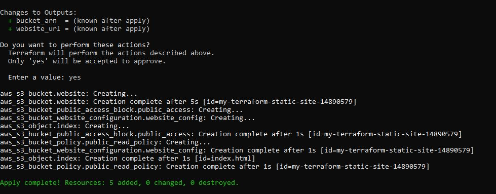
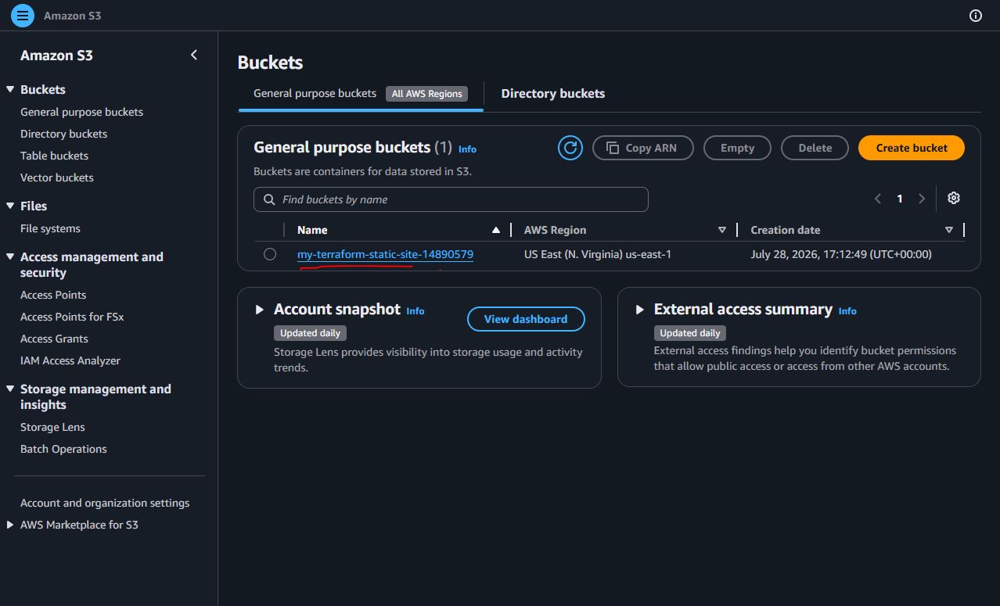
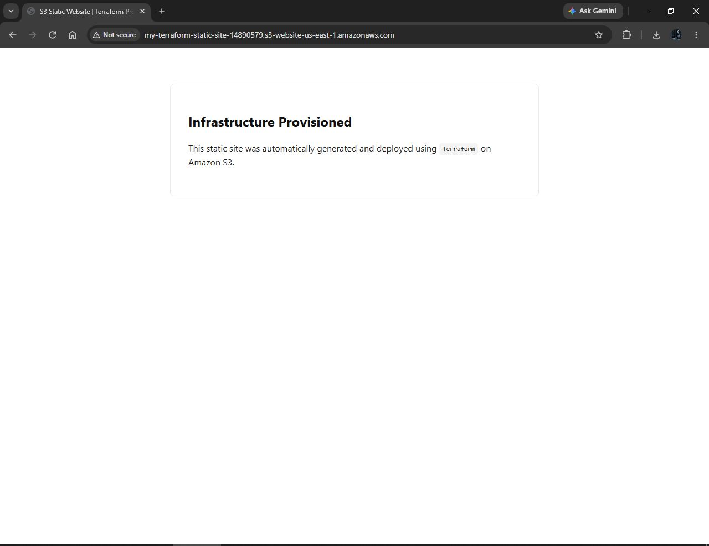
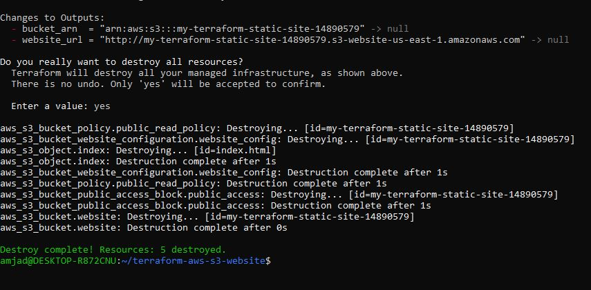

# terraform-aws-s3-website

Terraform Infrastructure as Code (IaC) project that provisions an **Amazon S3 static website** with public read access. The configuration creates the required AWS resources, uploads a website entry page, and outputs the website endpoint after deployment.

---

# Features

- Creates an Amazon S3 bucket for static website hosting
- Configures the bucket as an S3 Website Endpoint
- Uploads a local `index.html` file automatically
- Configures a bucket policy allowing public read access
- Disables S3 Public Access Block settings required for website hosting
- Uses Terraform state management for repeatable deployments
- Supports complete cleanup using `terraform destroy`

---

# AWS Resources Created

| Resource | Purpose |
|----------|---------|
| `aws_s3_bucket` | Creates the S3 bucket that hosts the website |
| `aws_s3_bucket_website_configuration` | Enables static website hosting with `index.html` as the default page |
| `aws_s3_bucket_public_access_block` | Allows public website access by disabling restrictive public access settings |
| `aws_s3_bucket_policy` | Grants anonymous users permission to read website files (`s3:GetObject`) |
| `aws_s3_object` | Uploads the local `index.html` file into the bucket |

---

# Project Structure

```text
terraform-aws-s3-website/
│
├── images/
│   ├── terraform-apply.jpg
│   ├── s3-bucket.jpg
│   ├── website.jpg
│   └── terraform-destroy.jpg
│
├── main.tf
├── variables.tf
├── outputs.tf
├── provider.tf
├── index.html
├── .terraform.lock.hcl
└── README.md
```

---

# Prerequisites

Before deploying, ensure you have the following installed:

- Terraform **1.0+**
- AWS CLI **v2**
- An AWS account with sufficient IAM permissions

Configure your AWS credentials:

```bash
aws configure
```

---

# Deployment

## 1. Clone the Repository

```bash
git clone https://github.com/amjadkamara/terraform-aws-s3-website.git
cd terraform-aws-s3-website
```

## 2. Initialise Terraform

```bash
terraform init
```

Terraform downloads the required AWS provider plugins and creates the dependency lock file.

---

## 3. Review the Execution Plan

```bash
terraform plan
```

Expected output:

```text
Plan: 5 to add, 0 to change, 0 to destroy.
```

Terraform will create the following resources:

- Amazon S3 Bucket
- Website Configuration
- Public Access Block Configuration
- Bucket Policy
- Website Object (`index.html`)

---

## 4. Deploy the Infrastructure

```bash
terraform apply
```

When prompted, type:

```text
yes
```

Terraform will provision all AWS resources and upload the website.

---

## 5. Retrieve Outputs

```bash
terraform output website_url
terraform output bucket_arn
```

The `website_url` output provides the public URL for your hosted static website.

---

# Deployment Verification

The following screenshots demonstrate the successful deployment, verification, and teardown of the Terraform-managed infrastructure.

## Terraform Apply

Terraform successfully provisioned all AWS resources.



---

## Amazon S3 Bucket

The Amazon S3 bucket was successfully created and is visible in the AWS Management Console.



---

## Static Website

The uploaded `index.html` is publicly accessible through the Amazon S3 Static Website Endpoint.



---

## Terraform Destroy

Terraform successfully destroyed all managed AWS resources, leaving no infrastructure behind.



---

# Destroy Infrastructure

To remove all resources managed by Terraform:

```bash
terraform destroy
```

When prompted, type:

```text
yes
```

Terraform will delete all AWS resources created by this project.

---

# Technologies Used

- Terraform
- Amazon Web Services (AWS)
- Amazon S3
- AWS IAM
- AWS CLI

---

# Learning Objectives

This project demonstrates how to:

- Provision cloud infrastructure using Terraform
- Configure Amazon S3 for static website hosting
- Manage AWS infrastructure declaratively
- Implement Infrastructure as Code (IaC) best practices
- Deploy and manage website assets through Terraform
- Create repeatable and automated cloud infrastructure deployments

---

# Repository

https://github.com/amjadkamara/terraform-aws-s3-website

---

## Author

**Amjad M. Kamara**

Cloud Solutions Architect | DevOps Engineer | Infrastructure as Code (IaC) | AWS | Terraform